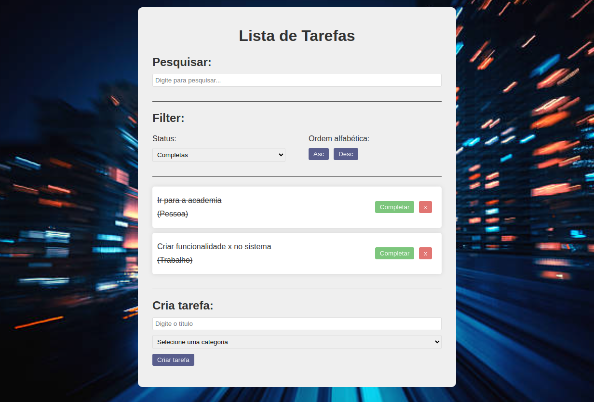

# 📝 To-Do List

Uma aplicação simples de lista de tarefas (To-Do List) desenvolvida em **React.js**, que permite adicionar, remover, completar, buscar e filtrar tarefas.

## 🚀 Funcionalidades

- ✅ Adicionar nova tarefa com categoria
- ✅ Marcar/desmarcar tarefa como concluída
- ✅ Remover tarefa
- 🔍 Buscar tarefas por texto
- 🎯 Filtrar por status (todas, completas, incompletas)
- 🔠 Ordenar tarefas por ordem alfabética (Asc/Desc)

## 📸 Demonstração

 <!-- opcional: adicione uma imagem do app rodando -->

## Inicie o servidor de desenvolvimento:
- npm install
- npm run dev
## 🧪 Tecnologias utilizadas

- [React](https://reactjs.org/)
- HTML5
- CSS3
- JavaScript (ES6+)
- Hooks (`useState`)

## 📺 Referência

Este projeto foi desenvolvido com base no tutorial do canal **Matheus Battisti - Hora de Codar**:

🔗 [Criando um To-Do List com React.js (YouTube)](https://www.youtube.com/watch?v=YVEVrigByKY)
